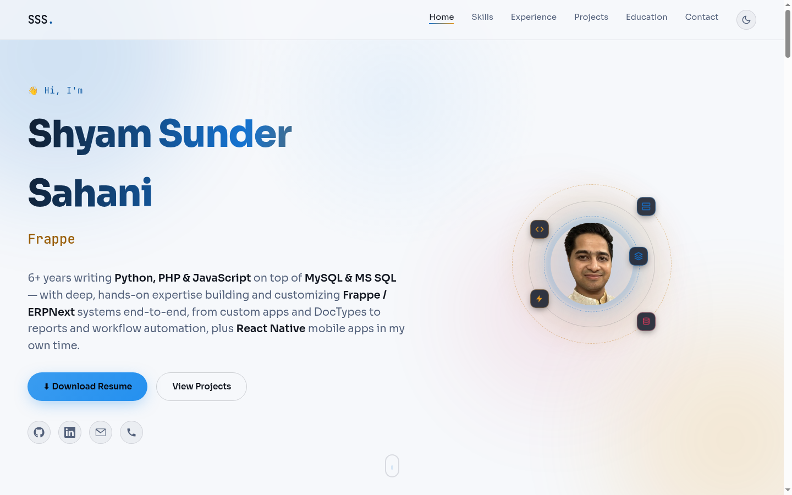

# Shyam Sunder Sahani — Portfolio

Personal portfolio website for **Shyam Sunder Sahani** — ERP Manager & Frappe / ERPNext Developer, Jaipur, India.

🔗 **Live:** [shyamsahani01.github.io](https://shyamsahani01.github.io/)



## About

A single-page portfolio covering 6+ years of hands-on ERPNext/Frappe work — custom apps, DocTypes,
print formats, reports and workflow automation — alongside PHP/JavaScript web development and
personal React Native apps. Sections: Skills, Experience, Projects, Education, Contact, plus a
downloadable ATS-friendly resume.

**Highlights:**
- 🌗 Dark / light theme toggle (persisted via `localStorage`, defaults to light)
- 🧭 Interactive ERPNext module map and numbered "core expertise" list
- 🪐 Orbiting avatar with animated tech badges in the hero section
- 📄 One-click resume download (PDF, generated to be ATS-parseable)
- 🎨 Fully responsive, no build step, no framework — plain HTML/CSS/JS

## Tech stack

Plain **HTML / CSS / JavaScript** — no framework, no bundler, no `npm install`. Just open
`index.html` in a browser or serve the folder as static files.

## Run locally

```bash
cd portfolio
python3 -m http.server 8080
# visit http://localhost:8080
```

## Deployment

Hosted on **GitHub Pages** (repo: `shyamsahani01/shyamsahani01.github.io`, branch `main`, root).
Any push to `main` redeploys automatically within 1-2 minutes — no CI config needed since the
repo name itself is the special `<username>.github.io` GitHub Pages format.

To update the live site:
```bash
git add -A
git commit -m "..."
git push origin main
```

## Project structure

```
portfolio/
├── index.html
├── assets/
│   ├── css/style.css
│   ├── js/script.js
│   ├── img/               # profile photo
│   ├── screenshots/        # README preview image
│   └── Shyam_Resume.pdf    # downloadable resume
└── README.md
```
